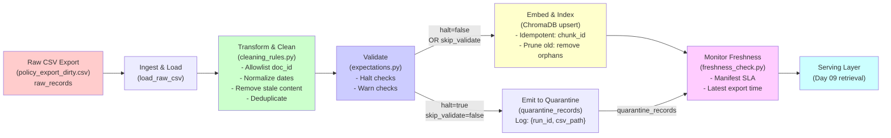

# Kiến trúc pipeline — Lab Day 10

**Nhóm:** Team Data Pipeline & Observability  
**Cập nhật:** 15 tháng 4, 2026

---

## 1. Sơ đồ luồng (bắt buộc có 1 diagram: Mermaid / ASCII)



> **Luồng chính (happy path - Sprint 2 chuẩn):**  
> Raw → Ingest → Transform (clean, dedupe, normalize) → Validate (E1-E8) → 
> Embed (upsert) → Freshness check → Serving

> **Luồng injection (Sprint 3 - kiểm thử):**  
> `--no-refund-fix --skip-validate` → bỏ qua fix 14→7 ngày + bỏ qua halt → Quarantine + Embed dù bẩn → Eval kém

---

## 2. Ranh giới trách nhiệm

| Thành phần | Input | Output | Owner nhóm | Ghi chú |
|------------|-------|--------|--------------|---------|
| **Ingest** | CSV (policy_export_dirty.csv) | Row list (raw_records) | Thành viên 1 | Load, map schema, log count |
| **Transform** | raw_records | cleaned_records, quarantine_records | Thành viên 1 | 6+ cleaning rules (baseline + 3 mới) |
| **Quality** | cleaned_records | expectations results (E1-E8) | Thành viên 2 | 2 expectation mới: halt + warn |
| **Embed** | cleaned_records | ChromaDB collection | Thành viên 2 | Idempotent upsert, prune old |
| **Monitor** | manifest.json | freshness status | Thành viên 3 | SLA check, log to runbook |
| **Serving** | ChromaDB | retrieval results | Day 09 agent | Use day10_kb collection |

---

## 3. Idempotency & rerun (Chi tiết của Thành viên 2)

### 3.1 Vấn đề: Duplicate vector khi rerun

Nếu chạy pipeline 2 lần trên cleaned_records tương tự:
- Lần 1: Insert 100 chunks → ChromaDB có 100 vectors
- Lần 2: Insert 100 chunks lại → Có 200 vectors (duplicate) ❌

### 3.2 Giải pháp: Upsert + Prune

**Upsert theo chunk_id (idempotent):**
```python
# chunk_id sinh từ: hashlib.sha256(f"{doc_id}|{chunk_text}|{seq}".encode())[:16]
col.upsert(ids=chunk_ids, documents=documents, metadatas=metadatas)
```
- Nếu chunk_id đã tồn tại → cập nhật vector, metadata
- Nếu chunk_id mới → thêm vào collection
- Kết quả: Lần 1 & 2 đều có đúng 100 vectors ✓

**Prune: Xóa chunk_id cũ không còn trong new run**
```python
prev_ids = set(col.get(include=[]).get("ids") or [])
orphans = prev_ids - set(new_chunk_ids)
col.delete(ids=list(orphans))
```
- Nếu lần 2 có 95 chunks (5 bị quarantine) → xóa 5 cũ → collection có 95 vectors ✓
- Tránh: "cũ stale" trong top-k retrieval

### 3.3 Ý nghĩa metric:
- **Embed upsert count**: số chunk được upsert trong run
- **Embed prune removed**: số chunk cũ bị xóa (orphan)
- **Collection size**: = upsert count sau prune (trong 1 snapshot)

---

## 4. Liên hệ Day 09

### Dữ liệu sau embed có phục vụ lại multi-agent Day 09?

**Kết nối:**
- Day 10 lab → sinh collection `day10_kb` trong ChromaDB
- Day 09 lab → các agent query `day10_kb` để retrieval
- **Cùng `data/docs/`** (5 tài liệu: policy_refund, hr_leave, it_helpdesk, sla_p1, access_control)
- **Cùng `data/test_questions.json`** (3 câu golden retrieval)

### Lợi ích:
- Day 10 → clean & validate dữ liệu trước embed
- Day 09 → agent không phải lo về dữ liệu bẩn / stale / duplicate
- **Idempotency** → rerun Day 10 không làm agent query kỳ quặc → consistent result

---

## 5. Rủi ro đã biết

1. **SentenceTransformer cold start** (~90MB download lần 1)
   - Mitigation: `.env` cấu hình EMBEDDING_MODEL, offline mode

2. **Manifest không được commit** 
   - Kỳ vọng: `artifacts/manifests/` có run log (~3 mẫu khi nộp bài)
   - Metric: `raw_records`, `cleaned_records`, `quarantine_records` ghi rõ trong log

3. **Stale content từ multiple versions (14→7 ngày, 10→12 ngày phép)**
   - Mitigation: Cleaning rule baseline + expectation halt check
   - Test: `--no-refund-fix` để simulate "before" stale state

4. **Duplicate effective_date khi cùng doc**
   - Current: Quarantine nếu < 2026-01-01 hoặc không ISO
   - Future: Có thể add rule: giữ bản ngày mới nhất

5. **Empty chunk_text sau clean**
   - Halt expectation E4: chunk_min_length_8 > 0 có handle
   - Prune: Xóa trong expectation, không dùng kém nên không embed

6. **Freshness SLA quá chặt / lỏng**
   - Baseline: 24h (mặc định .env)
   - Tune: nhóm có thể đổi tùy use case

---

## 6. Test plan (kiểm thử các scênario)

| Scênario | Lệnh | Kỳ vọng | Thành viên |
|----------|------|--------|-----------|
| Clean pass | `python etl_pipeline.py run --run-id sprint2` | exit 0, 8 expectation OK | 2 |
| Inject corruption | `python etl_pipeline.py run --no-refund-fix --skip-validate --run-id sprint_bad` | halt expectation fail, vẫn embed | 3 |
| Retrieve befor/after | `python eval_retrieval.py --out artifacts/eval/before_after.csv` | CSV có top-k hits / miss | 3 |
| Freshness check | `python etl_pipeline.py freshness --manifest artifacts/manifests/manifest_sprint2.json` | PASS / WARN / FAIL tùy SLA | 3 |
